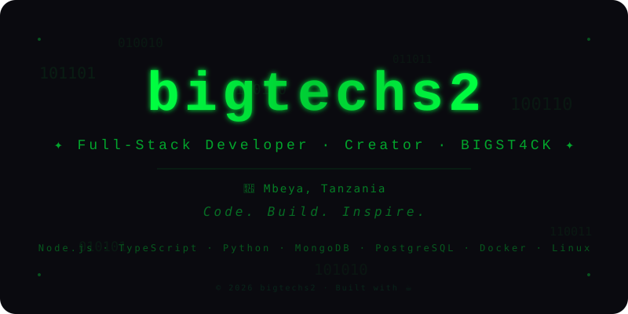

<!-- ─── MATRIX BANNER ─── -->

  

<!-- ─── OR PASTE THE SVG DIRECTLY ─── -->

  <svg xmlns="http://www.w3.org/2000/svg" viewBox="0 0 800 400" width="100%" height="100%">
    <!-- ─── PASTE THE FULL SVG CODE HERE ─── -->
  </svg>

---

## 👨‍💻 About Me

- 🔭 I'm currently building **BIGST4CK** – a powerful WhatsApp bot
- 🌱 I'm diving deeper into **TypeScript** and **Go**
- 👯 I'm looking to collaborate on **open-source projects**
- 💬 Ask me about **Node.js**, **WhatsApp bots**, or **Pterodactyl**
- 📫 How to reach me: [WhatsApp](https://wa.me/255636756591)
- ⚡ Fun fact: I code with music on – always! 🎵

---

## 🚀 Projects

| Project | Description | Status |
|---------|-------------|--------|
| [BIGST4CK](https://github.com/bigtechs2/BIGST4CK) | WhatsApp bot with 100+ commands | 🔥 Active |
| [bighosting](https://github.com/bigtechs2/bighosting) | Pterodactyl server store | 🚀 Deploying |
| [BIGDONATE](https://github.com/bigtechs2/BIGDONATE) | Donation platform | ✅ Live |
| Wi-Fi Hotspot | Time-based billing system | 🔧 Building |

---

## 🛠️ Tech Stack

---

## 📊 GitHub Stats

---

## 📬 Connect With Me

  
  
  
  

---

  
  *"Code. Build. Inspire."*
  
  © 2026 bigtechs2

